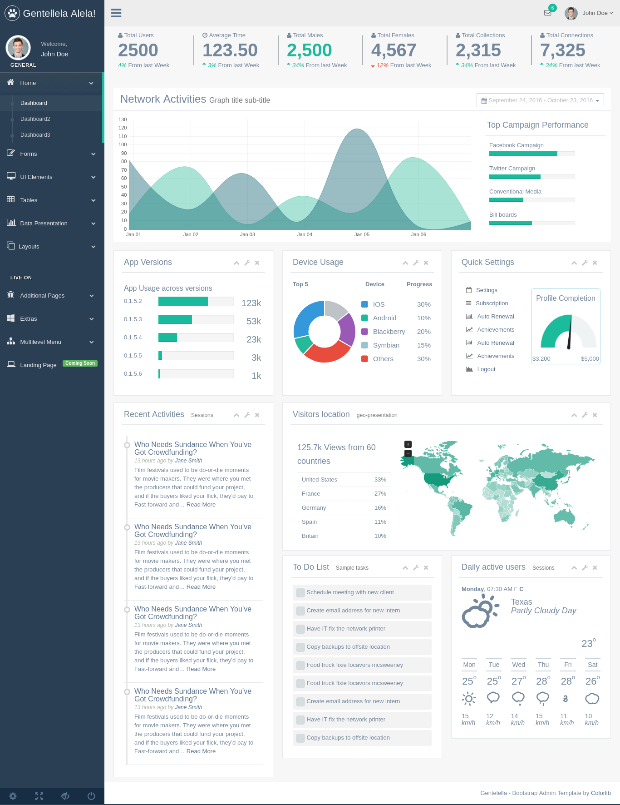
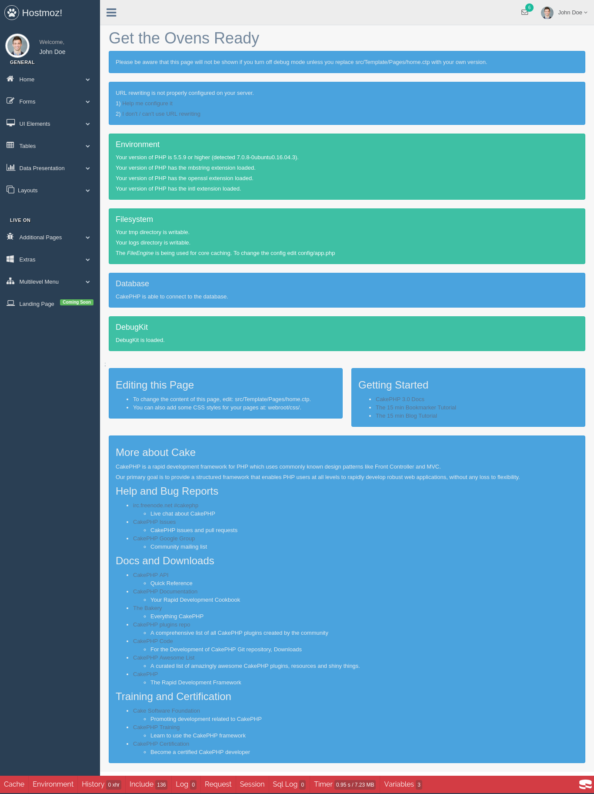

# CakePHP Gentelella Theme

## Gentelella Theme Demo
You can view the Demo of Gentelella Theme here: https://colorlib.com/polygon/gentelella/index.html

## Installation

You can install using [composer](http://getcomposer.org).

```
composer require backstageel/cakephp-gentelella-theme
```

### Enable Plugin

```php
// config/bootstrap.php

Plugin::load('Gentelella', ['bootstrap' => true, 'routes' => true]);
```

### Enable theme

```php
// src/Controller/AppController.php

public function beforeRender(Event $event)
{
    $this->viewBuilder()->theme('Gentelella');
}
```

### Using Bootstrap UI Plugin

This Theme Uses the BootstrapUI Plugin for CakePHP to create Bootstrap Forms. The Plugin will be installed automatically if you use composer.

Follow BootstrapUI settings to configure other aspects of the Plugin.

https://github.com/FriendsOfCake/bootstrap-ui

### Configure

```php
// src/Controller/AppController.php
use Cake\Core\Configure;

public function beforeRender(Event $event)
{
    // ...
    $this->set('theme', Configure::read('Theme'));
}
```

```php
// To customize configuration paste it at end of file config/bootstrap.php

Configure::write('Theme', [
    'title' => 'Gentelella',
    'logo' => [
        'mini' => '<b>G</b>T',
        'large' => '<b>Gentelella</b>Theme'
    ],
    'login' => [
        'show_remember' => true,
        'show_register' => true,
        'show_social' => true
    ]
]);
```

## Symlink Assets
Don't forget to Symlink Assets to improve performance
```batch
bin/cake plugin assets symlink
```

### Customize Layout

Replace the files according to the image.



1. `src/Template/Element/nav-top.ctp`
2. `src/Template/Element/aside-main-sidebar.ctp`
3. `src/Template/Element/aside/user-panel.ctp`
4. `src/Template/Element/aside/form.ctp`
5. `src/Template/Element/aside/sidebar-menu.ctp`
6. `src/Template/Element/aside-control-sidebar.ctp`
7. `src/Template/Element/footer.ctp`

### Page debug

Added link to default page of CakePHP.



## Contributing

1. Fork it
2. Create your feature branch (`git checkout -b my-new-feature`)
3. Commit your changes (`git commit -am 'Add some feature'`)
4. Push to the branch (`git push origin my-new-feature`)
5. Create new Pull Request
